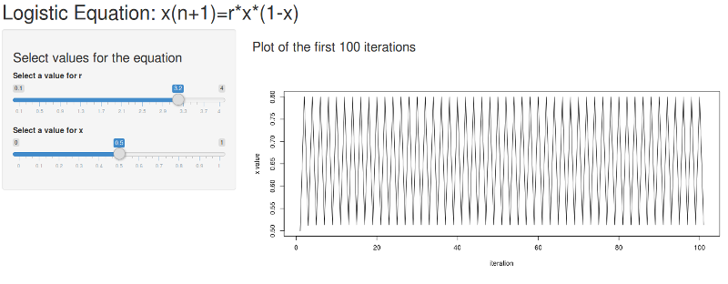
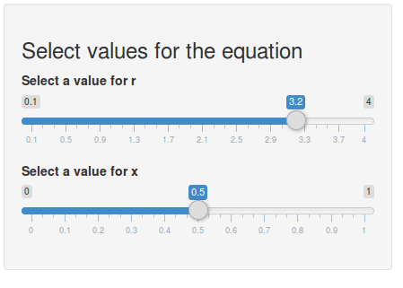
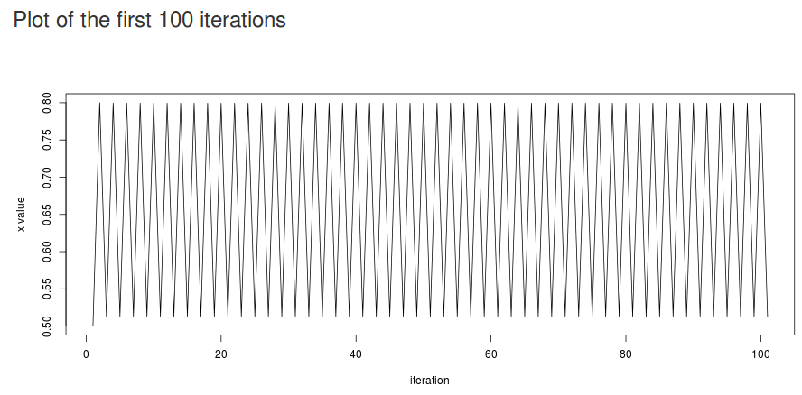

## App Overview

This app allows the user to play around with the logistic equation. The logistic equation is used as a simple example of chaos theory. Users can select various input values for the equation and view the result.




--- .class #id 

## The Logistic Equation

The logistic equation is an iterative equation, so the output value $x_{n+1}$ becomes the input for the next iteration of the equation, $x_n$.

$$x_{n+1} = rx_n(1-x_n)$$

Here is an example of the first few iterations using the default values from the app.

```{r}
y <- 0.5; x_new <- 0.5
for (i in 1:10){
  x_new <- 3.25*x_new*(1-x_new)
  y <- c(y,x_new)
}
y
```

---
## Input

Users use sliders to input values for the equation. The range is limited to what is believed to be the most interesting range of values. (0-4] for r and [0-1] for x.



---
## Output

A plot displays the first 100 iterations of the equation.




